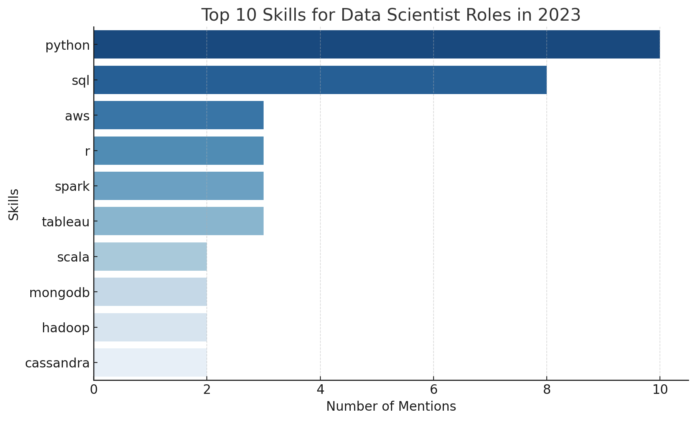
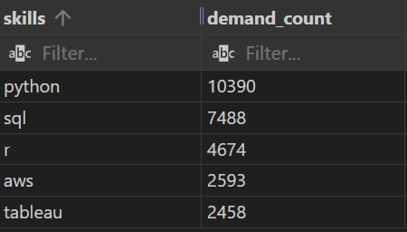
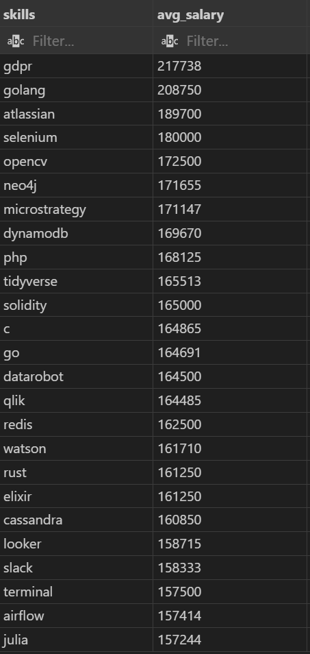
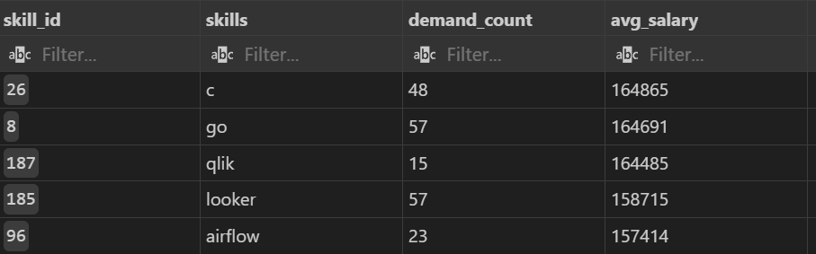

# Introduction 
This project explores the top-paying jobs, in-demand skills, and where high demand meets high salary in data analytics. For me, I'm focusing on data scientist roles.

- SQL queries? Check them out here: [project_sql folder](/project_sql/)

# Background 
Before I started this project, I'm still exploring which **career path to pursue**, so I decided to **analyse different high-paying roles** to better understand the job market. I **followed a YouTube tutorial** by Luke Barousse, where I learned how to **use SQL** to explore top-paying jobs like data analyst and data scientist. Through this analysis, **I gained a data-driven perspective on career opportunities,** while also improving my SQL abilities.

- [Clike here](https://www.youtube.com/watch?v=7mz73uXD9DA&t=0s) to Luke Barousse's SQL for Data Analytics YouTube video 

### The questions that I wanted to answer through my SQL queries were: 
1. What are the top-paying data analyst jobs?
2. What skills are required these top-paying jobs?
3. What skills are most in demand for data analysts?
4. Which skills are associated with higher salaries?
5. What are the most optimal skills to learn?

# Tools I Used 
- **SQL in Visual Studio Code** – Used for writing and running queries to analyze job market data.
- **PostgreSQL** – Served as the database management system to store and process data efficiently. 
- **Git & GitHub** – Used for version control and to document my progress throughout the project.
# The Analysis 
Each query for this project aimed at investigating specific aspects of the data analyst job market. Here's how I approached each question:

### 1. Top Paying Data Scientist Jobs
To identify the highest-paying rotesi I filtered data scientist positions by average yearly salary and location, focusing on remote jobs. This query highlights the high paying opportunities in the field.

```sql
SELECT
    job_id,
    job_title,
    job_location,
    job_schedule_type,
    salary_year_avg,
    job_posted_date,
    name AS company_name
FROM
    job_postings_fact
LEFT JOIN company_dim ON job_postings_fact.company_id = company_dim.company_id
WHERE
    job_title = 'Data Scientist' AND
    job_location = 'Anywhere' AND
    salary_year_avg IS NOT NULL
ORDER BY
    salary_year_avg DESC
LIMIT 10
```

Here's the breakdown of the top data analyst jobs in 2023:

- **Wide Salary Range:** Top l0 paying data scientist roles span from $185,000 to $375,000, indicating significant salary potential in the field.
- **Diverse Employers:** Companies like
Algo Capital Group, Grammarly, and Smith Hanley Associates are among those offering high salaes, showing a broad interest across different iådustries.

### 2. Skills for Top Paying Jobs
To understand what skills are required for the top—paying jobs, I joined the job postings with the skills data, providing insights into what employers value for high-compensation roles.

```sql
WITH top_paying_jobs AS (
    SELECT
        job_id,
        job_title,
        salary_year_avg,
        name AS company_name
    FROM
        job_postings_fact
    LEFT JOIN company_dim ON job_postings_fact.company_id = company_dim.company_id
    WHERE
        job_title = 'Data Scientist' AND
        job_location = 'Anywhere' AND
        salary_year_avg IS NOT NULL
    ORDER BY
        salary_year_avg DESC
    LIMIT 10
)

SELECT 
    top_paying_jobs.*,
    skills
FROM
    top_paying_jobs
INNER JOIN skills_job_dim ON top_paying_jobs.job_id = skills_job_dim.job_id
INNER JOIN skills_dim ON skills_job_dim.skill_id = skills_dim.skill_id
ORDER BY
    salary_year_avg DESC
```
Here's the breakdown of the most demanded skills for the top 1O highest paying data analyst jobs in 2023: 

- **Python and SQL** stand out as essential skills, appearing significantly more often than others.
- Cloud platforms like **AWS** and big data tools such as Spark and Hadoop are also in demand.
- Data visualization tools like **Tableau** appear as well, reflecting the need for effective data communication.


*Bar graph visualising the top 10 skills for data scientist; ChatGPT generated this graph from my SQL query results.*

### 3. In-Demand Skills for Data Scientists 
This query helped identify the skills most frequently requested in job postings, directing focus to areas with high demand.

```sql
SELECT 
    skills,
    COUNT(skills_job_dim.job_id) AS demand_count
FROM job_postings_fact
INNER JOIN skills_job_dim ON job_postings_fact.job_id = skills_job_dim.job_id
INNER JOIN skills_dim ON skills_job_dim.skill_id = skills_dim.skill_id
WHERE
    job_title_short = 'Data Scientist' AND
    job_work_from_home = TRUE
GROUP BY
    skills
ORDER BY
    demand_count DESC
LIMIT 5
```
Here's the breakdown of the most demanded skills for data analysts in 2023:
- SQL remain fundamental, emphasizing the need for strong foundational skills in data processing 
manipulation.
- Programming Tools like Python and R are essential, pointing towards the increasing importance of technical skills.
- Visualisation tools like Tableau is also essential, indicating the importance of data visualisation that may assist people's decisions. 


*Table of the demand for the top 5 skills in data analyst job postings*

### 4. Skills Based on Salary
Exploring the average salaries associated with different skills revealed which skills are the highest paying.

```sql
SELECT 
    skills,
    ROUND(AVG(salary_year_avg),0) AS avg_salary
FROM job_postings_fact
INNER JOIN skills_job_dim ON job_postings_fact.job_id = skills_job_dim.job_id
INNER JOIN skills_dim ON skills_job_dim.skill_id = skills_dim.skill_id
WHERE
    job_title_short = 'Data Scientist' AND
    job_work_from_home = TRUE AND
    salary_year_avg IS NOT NULL 
GROUP BY
    skills
ORDER BY
    avg_salary DESC
LIMIT 25
```
Here's a breakdown of the results for top paying skills for Data Scientist:

**Trend Towards Modern Skills:** Skills like "Golang" and "Solidity" (blockchain) suggest that expertise in cutting-edge programming languages and blockchain technology is highly lucrative. Investing in these areas could be advantageous for professionals.

**Demand for Data Tools & AI Skills:** Tools like "watson", "julia", "opencv", and "datarobot" show that skills in artificial intelligence, machine learning, and data science remain a high-paying career path.

**Industry-Specific Skills Dominate:** GDPR-related expertise appears to be uniquely valuable—likely tied to legal and compliance demands in data privacy.

 
*Table of the average salary for the top 10 paying skills for data analysts*

### 5. Most Optimal Skills to Learn
Combining insights from demand salary data, this query aimed to pinpoint skills that are both in high demand and have high salaries, offering a strategic focus for skill development.

```sql
WITH skills_demand AS (
    SELECT
        skills_dim.skill_id, 
        skills_dim.skills,
        COUNT(skills_job_dim.job_id) AS demand_count
    FROM job_postings_fact
    INNER JOIN skills_job_dim ON job_postings_fact.job_id = skills_job_dim.job_id
    INNER JOIN skills_dim ON skills_job_dim.skill_id = skills_dim.skill_id
    WHERE
        job_title_short = 'Data Scientist' AND
        job_work_from_home = TRUE AND
        salary_year_avg IS NOT NULL 
    GROUP BY
        skills_dim.skill_id
), average_salary AS (
    SELECT 
    skills_job_dim.skill_id,
    ROUND(AVG(salary_year_avg),0) AS avg_salary
FROM job_postings_fact
INNER JOIN skills_job_dim ON job_postings_fact.job_id = skills_job_dim.job_id
INNER JOIN skills_dim ON skills_job_dim.skill_id = skills_dim.skill_id
WHERE
    job_title_short = 'Data Scientist' AND
    job_work_from_home = TRUE AND
    salary_year_avg IS NOT NULL 
GROUP BY
    skills_job_dim.skill_id
)

SELECT
    skills_demand.skill_id,
    skills_demand.skills,
    demand_count,
    avg_salary
FROM
    skills_demand
INNER JOIN average_salary ON skills_demand.skill_id = average_salary.skill_id
WHERE
    demand_count > 10
ORDER BY
    avg_salary DESC,
    demand_count DESC
    
LIMIT 5
```

*Table of the most optimal skills for data analyst sorted by salary*

Here's a breakdown of the most optimal skills for Data Scientist in 2023:

**Balancing Salary and Demand:** Professionals focusing on "go" or "c" might find lucrative opportunities as both skills combine strong salary potential with reasonable demand.

**High Demand Areas:** Skills like "looker" and "go" are highly sought after. For individuals or teams, aligning learning or hiring strategies with these skills could maximize employability or business success.

**Niche vs. Broad Use Cases:** Tools like "airflow" and "qlik" may have smaller demand counts but still offer competitive salaries. These could represent niche areas where expertise is especially valued.

# What I Learned 
Throughout this adventure, I've turbocharged my SQL toolkit with some serious firepower:

- **Complex Query Crafting:** I learned the basics of SQL and some of the advanced level of SQL, merging tables like a pro and wielding WITH clauses for ninja—level temp table maneuvers.
- **Data Aggregation:** I used a lot of with GROUP BY and turned aggregate functions tike COI..NT() and AVG( ) into my data-sumarizing sidekicks.
- **Analytical Wizardry:** I obtained some real—world puzzle—solving skills by using SQL, turning questions into actionable, insightful SQL queries.

# Conclusions 
### Insights
1. **Top Data Analyst Jobs in 2023:** The highest-paying data scientist roles offer salaries between $185,000 and $375,000, with diverse employers like Algo Capital Group and Grammarly showing interest across industries.

2. **Most Demanded Skills for Top 10 Highest Paying Data Analyst Jobs in 2023:** Python and SQL are essential, complemented by demand for cloud platforms like AWS, big data tools (Spark, Hadoop), and visualization tools like Tableau.

3. **Most Demanded Skills for Data Analysts in 2023:** Foundational skills in SQL, programming expertise in Python and R, and visualization proficiency with Tableau remain critical for data analysis success.

4. **Top Paying Skills for Data Scientists:** Modern programming (Golang, Solidity), data tools (Watson, Julia), and GDPR-related compliance expertise dominate as high-value skillsets for data scientists.

5. **Optimal Skills for Data Scientists in 2023:** Skills like "Go" and "C" offer lucrative opportunities, while niche tools like Airflow and Qlik provide competitive pay despite lower demand.

### Closing thoughts
This SQL project marks an important milestone in my learning journey. As someone who started with no prior experience, following a YouTube tutorial to grasp these skills has been both challenging and incredibly rewarding. I found the process of analyzing data, uncovering patterns, and creating insights deeply engaging, which has further fueled my passion for data and technology. I'm excited to keep exploring and refining my abilities, and I hope to expand my knowledge and experience through future opportunities, such as internships, where I can continue to grow and contribute meaningfully to real-world projects. This is just the beginning of a long and fulfilling journey in this field!
